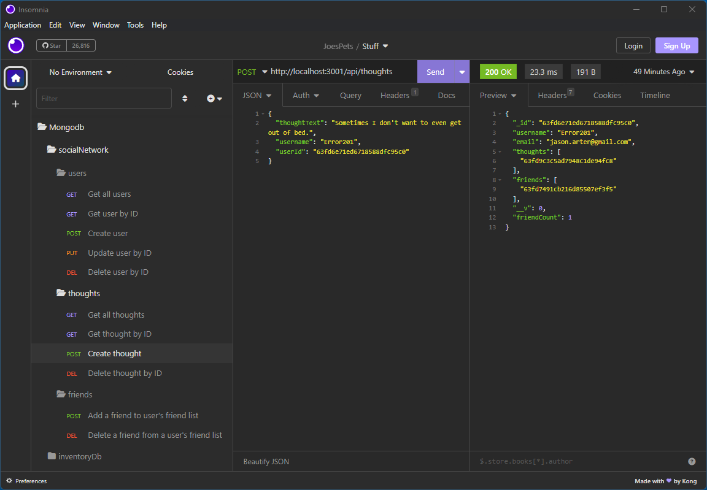

# socialNetwork

## Description

This project was created in order to learn how to use a NoSQL database (MongoDb and Mongoose.js) using the Model, View, Controller (MVC) design pattern. I learned how to use routes, controllers, and models/schemas using MongoDb to create the server side of a website from the ground up.

---
## Table of Contents (Optional)

- [Installation](#installation)
- [Usage](#usage)
- [Credits](#credits)
- [License](#license)

---
## Installation

At the command prompt (or in a terminal), type the following to install:
```
git clone git@github.com:error201/SocialNetwork.git
```
Navigate into the cloned repository and type the following to install the necessary Node.js packages:
```
npm install
```
To start the server, type the following:
```
npm run start
```
---
## Usage
See this [video](https://drive.google.com/file/d/1uLLaiwMKxbniRdxHNhiGvrqPVfRChyZr/view) for a demonstration.

The API is broken up into several HTTP routes:
 - Users
   - To add a user: send a ```POST``` request to ```http://localhost:3001/api/users/``` following the below example for the request body:
     - ```
       {
	       "username": "username1",
	       "email": "john.doe@gmail.com"
       }
       ```
   - To get **ALL** users: send a ```GET``` request to  ```http://localhost:3001/api/users/```
   - To get a single user: send a ```GET``` request to  ```http://localhost:3001/api/users/[userId]```
     - ```
       http://localhost:3001/api/users/63fd6e71ed6718588dfc95c0
       ```
   - To update a user: send a ```PUT``` request to  ```http://localhost:3001/api/users/[userId]``` following the below example for the request body:
     - ```
       {
	       "username": "username1",
	       "email": "john.doe@gmail.com"
       }
       ```
   - To delete a single user: send a ```DELETE``` request to  ```http://localhost:3001/api/users/[userId]```
     - ```
       http://localhost:3001/api/users/63fd6e71ed6718588dfc95c0
       ```
 - Thoughts:
   - To add a thought: send a ```POST``` request to ```http://localhost:3001/api/thoughts/``` following the below example for the request body:
     - ```
       {
	       "thoughtText": "This is a single thought...",
	       "username": "username1",
           "userId": "63fd6e71ed6718588dfc95c0"
       }
       ```
   - To get **ALL** thoughts: send a ```GET``` request to  ```http://localhost:3001/api/thoughts/```
   - To get a single user: send a ```GET``` request to  ```http://localhost:3001/api/thoughts/[thoughtId]```
     - ```
       http://localhost:3001/api/thoughts/63fd6e71ed6718588dfc95c1
       ```
   - To update a thought: send a ```PUT``` request to  ```http://localhost:3001/api/thoughts/[thoughtId]``` following the below example for the request body:
     - ```
       {
	       "thoughtText": "This is my sencond thought...",
	       "username": "username1",
           "userId": "63fd6e71ed6718588dfc95c0"
       }
       ```
   - To delete a single thought: send a ```DELETE``` request to  ```http://localhost:3001/api/thoughts/[thoughtId]```
     - ```
       http://localhost:3001/api/thoughts/63fd6e71ed6718588dfc95c1
       ```




---
## Credits

 - [Node.js](https://nodejs.org/en/)
 - [MongoDb](https://www.mongodb.com/)
 - [Mongoose.js](https://mongoosejs.com/)

---
## License

This project is covered under the MIT license. Please see [LICENSE](./LICENSE) for details.

---

## Badges


## How to Contribute

Feel free to submit a pull request or clone this repository.
